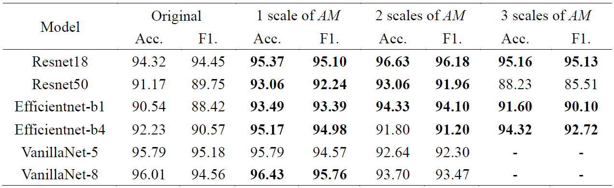
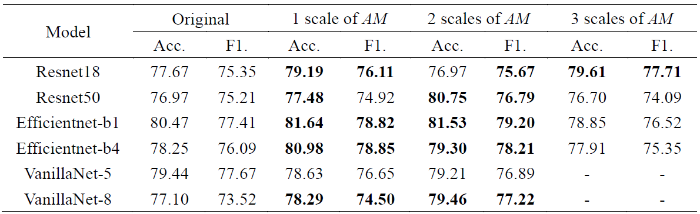
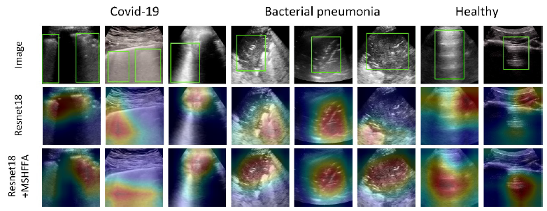

# MSHFFA
Multi-scale high-frequency feature augmentation

## Effect of MSHFFA on POCUS dataset

## Effect of MSHFFA on BLU dataset

## GradCam comparison

## Coupled Training 
### POCUS dataset
The split training-test dataset can be obtained from [here](https://github.com/983632847/USCL)   
### Training MSHFFA-added model with POCUS dataset
Run ___train_POCUS_MSHFFA.py___ (Note to change project dir and save dir)
### BLU dataset
The dataset can be obtained from [here](https://github.com/jhl-Det/CVA-Net)
### Training MSHFFA-added model with BLU dataset
Run ___train_BLU_MSHFFA.py___ (Note to change project dir and save dir)
## References
1. https://github.com/lpj-github-io/MWCNNv2